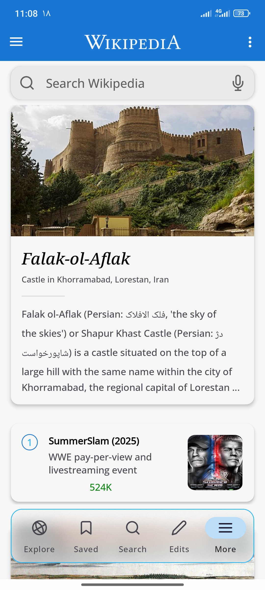
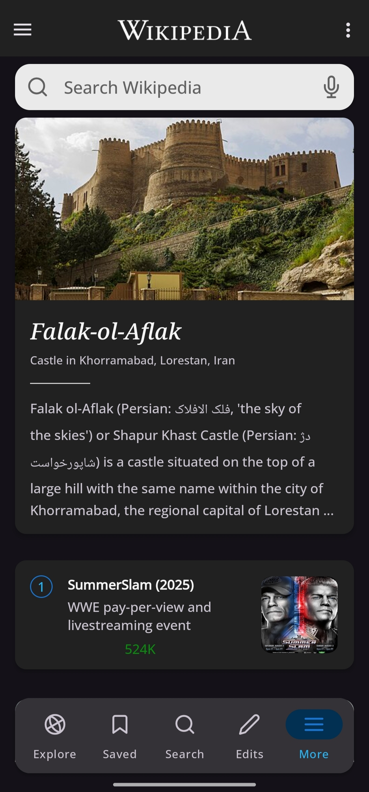
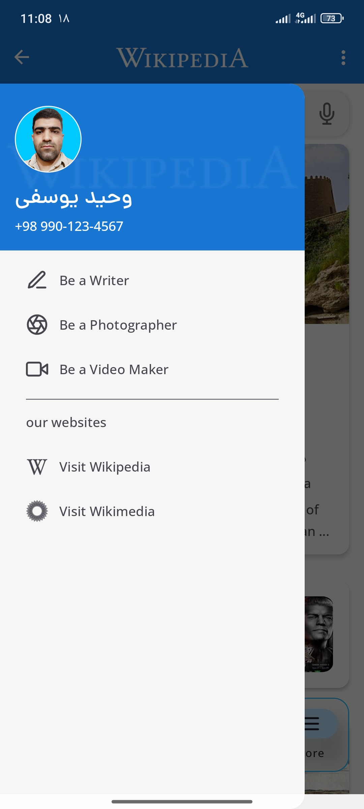
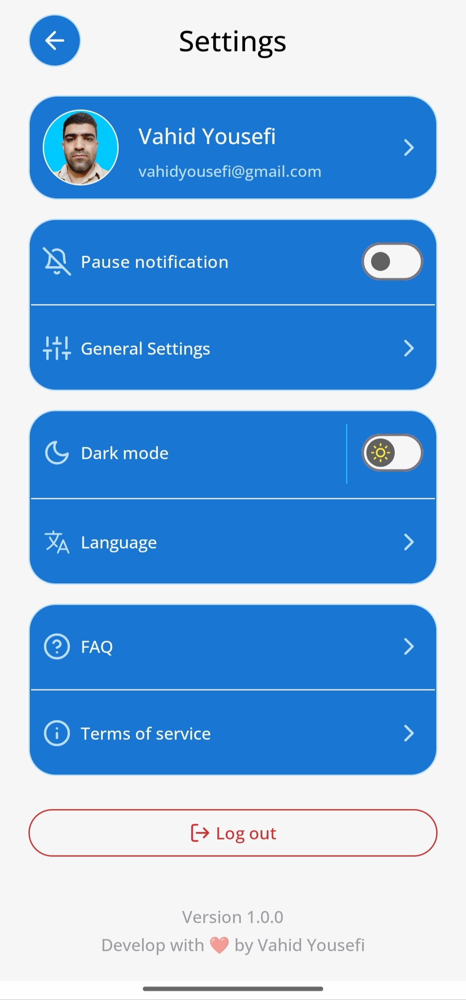

**Wikipedia** app with a Material Design look for Android, developed with Kotlin and XML
| Dark Mode | Light Mode |
|--|--|
|  |  |
|  |  |
|  |  |

# Features 🚀
* **Search Wikipedia articles**
* **Display articles with a simple and user-friendly interface**
* **Using Kotlin for application logic**
* **Designing user interfaces with XML**
* **Compatibility with different versions of Android**

# Used libraries 📚
* **[Glide]**
* **[ion Alert]**
* **[Sweet Alert Dialog]**
* **[circle image view]**

# Instalation ⬇️
```
git clone https://github.com/vahidyousefi/wikipedia
```
# Contribute ❤️
### If you are interested in contributing to this project:
1. Fork the repository from `https://github.com/vahidyousefi/wikipedia`
2. Put your changes in a new branch
3. Submit a Pull Request.

[Glide]: https://github.com/bumptech/glide
[Blur View]: https://github.com/Dimezis/BlurView
[ion Alert]: https://github.com/oktavianto/ionalert
[Sweet Alert Dialog]: https://github.com/F0RIS/sweet-alert-dialog
[circle image view]: https://github.com/hdodenhof/CircleImageView
